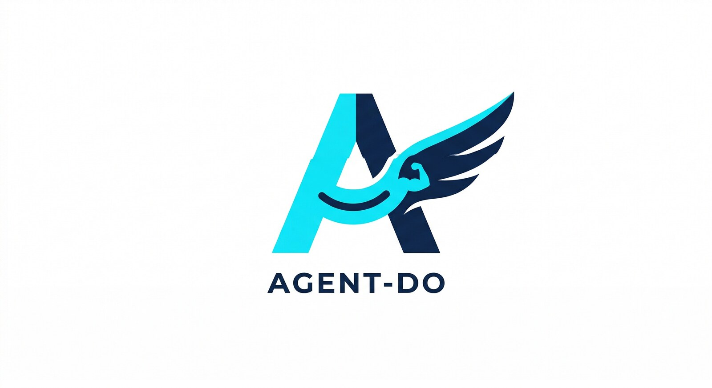

# agent-do

<p align="center">
  
</p>

<p align="center"><strong>The outer harness for AI coding agents.</strong></p>

Claude Code, Cursor, and similar agents are strong inside a codebase. They read files, write code, run tests, and reason well. The hard part begins at the edge: browsers, simulators, databases, cloud platforms, design review, project memory, issue tracking, and the rest of the world outside the repo.

`agent-do` is the outer harness. It gives the inner agent one durable contract for acting in that world.

```bash
agent-do <tool> <command> [args...]
```

That is the center of gravity. Around it, `agent-do` adds discovery, nudging, health checks, bootstrap flows, secure credential resolution, auth-state orchestration, repo-local spec management, and natural-language routing. The result is simple to remember, easy to enforce through hooks, and broad enough to cover 87 tools.

When a command needs permission to control the visible local machine, `agent-do` uses an explicit runtime modifier instead of a wrapper tool:

```bash
agent-do +live(scope=desktop,ttl=15m) macos click @g5
```

## Why It Exists

Most agents know how to improvise. That is useful until it is not.

When an agent falls back to raw CLIs, custom curl calls, ad hoc Playwright scripts, or fragile shell glue, the session gets harder to understand, harder to repeat, and harder to improve. `agent-do` narrows that surface. It gives the agent a cleaner path:

- one command shape
- one registry
- one place for setup and readiness
- one discovery layer when the right tool is not obvious
- one hook surface for hard nudges without hard blocking

This is not a replacement for the inner agent. It is the structure around the inner agent that makes better behavior easier to choose.

## The Shape Of The System

The best `agent-do` tools share the same operational rhythm:

```text
Connect → Snapshot → Interact → Verify → Save
```

Snapshot is the hinge. An agent cannot reason well about a browser page, a database schema, or an iOS screen if it cannot see the current state in a structured way. Mature tools in this repo are designed around that need.

```bash
agent-do db connect mydb
agent-do db snapshot
agent-do db query "SELECT * FROM orders LIMIT 10"
agent-do db sample orders 5
agent-do db disconnect
```

Some tools are deep systems. Some are thinner wrappers. All of them aim at the same outer contract.

## Core Commands

When you already know the tool:

```bash
agent-do <tool> <command> [args...]
```

When you know the goal but not the tool:

```bash
agent-do suggest "deploy this service"
agent-do suggest --project
agent-do find playwright
```

When you want setup and readiness:

```bash
agent-do --health
agent-do bootstrap --recommend
agent-do bootstrap
agent-do nudges stats
```

When you need to notify a human across channels:

```bash
agent-do notify set-recipient me --sms +15551234567 --email me@example.com --slack @erik --messenger https://www.messenger.com/t/example-thread --prefer sms,slack,email
agent-do notify set-group ops me backup
agent-do notify templates
agent-do notify apply-template build_failed --recipient me
agent-do notify history --limit 10
agent-do notify me "Build failed"
agent-do notify ops "Heads up"
agent-do notify me "Deploy complete" --via slack
agent-do +live(scope=desktop,app=Messenger,ttl=15m) notify me "Need approval" --via messenger
agent-do notify set-rule build_failed --recipient me --event build --message "Build failed for {service}" --match status=failed --cooldown 30m
agent-do notify emit build --fact service=api --fact status=failed
agent-do notify reset-state build_failed
agent-do notify delete-rule build_failed
agent-do notify recipients
```

When a tool needs secrets:

```bash
agent-do creds required render
agent-do creds store RENDER_API_KEY --stdin
agent-do creds check --tool render
```

When a site needs authenticated state:

```bash
agent-do auth init github
agent-do creds store GITHUB_TOTP_SECRET --stdin
agent-do creds store GITHUB_BACKUP_CODES --stdin
agent-do auth ensure github
agent-do auth probe github
agent-do auth advance github
agent-do auth validate github
```

When a command needs explicit permission to control the visible local machine:

```bash
agent-do +live(scope=desktop,ttl=15m) macos click @g5
agent-do +live(scope=desktop,ttl=15m) screen click --text "Continue"
```

When another site uses provider SSO:

```bash
agent-do auth init widgethub --domain app.example.com --login-url https://app.example.com/login --provider github
agent-do auth ensure widgethub --strategy provider-refresh
```

When anti-bot or remote human-visible login requires a real system browser:

```bash
agent-do auth init cloudflare --domain dash.cloudflare.com --login-url https://dash.cloudflare.com/login --provider github
agent-do auth ensure cloudflare --strategy interactive --timeout 300
```

When the agent itself needs to keep controlling that visible real browser instead of importing back into Playwright:

```bash
agent-do +live(scope=browser,app=Arc,ttl=15m) auth ensure cloudflare --strategy live-browser-control --timeout 300
```

When a site emails a verification code or magic link:

```bash
agent-do auth init widgethub --domain app.example.com --login-url https://app.example.com/login --email-code --email-from WidgetHub --email-subject "verification code" --email-account Work --email-mailbox Inbox
agent-do auth ensure widgethub
```

When a site texts a verification code or magic link:

```bash
agent-do auth init widgethub --domain app.example.com --login-url https://app.example.com/login --sms-code --sms-from WidgetHub --sms-contains "verification"
agent-do auth ensure widgethub
```

When the repo needs durable behavior specs and change artifacts:

```bash
agent-do spec init
agent-do spec new add-oauth-device-flow --spec auth
agent-do spec status --change add-oauth-device-flow
```

When a human wants natural language routing:

```bash
agent-do -n "take an iOS screenshot"
agent-do --offline "deploy this on vercel"
agent-do --how "check render logs"
```

## Standout Tools

### `browse`

An AI-first Playwright surface with snapshot-driven interaction, reference IDs, headed login handoff, and API capture.

```bash
agent-do browse open https://app.example.com
agent-do browse snapshot -i
agent-do browse fill @e3 "admin"
agent-do browse click @e7
agent-do browse wait --stable
```

For sites with SSO or MFA:

```bash
agent-do browse login https://app.example.com
agent-do browse login done --save mysite
agent-do browse session load mysite
agent-do browse session import-browser mysite --browser comet --domain .example.com
```

`session import-browser` now carries Chromium cookies, localStorage, sessionStorage, and best-effort IndexedDB into the saved browse session when those stores are available and serializable.

`browse` daemon sessions are isolated. If you do not pass `--session` and do not set `AGENT_BROWSER_SESSION`, `agent-do browse` derives a per-agent daemon session automatically when an agent/thread identity like `CODEX_THREAD_ID` is available. That prevents multiple agents from stomping the same implicit browser daemon.

When a non-default agent daemon saves back to an existing shared saved-session name, `browse` now forks that write to an agent-scoped saved-session name by default instead of silently overwriting the shared base. Use `--shared` on `session save` or `login done --save` if you really want to update the literal shared saved-session name.

For turning a browsing session into a reusable curl skill:

```bash
agent-do browse capture start
agent-do browse capture stop myapi
agent-do browse api myapi get_users
```

For exact values hidden behind copy buttons instead of visible page text:

```bash
agent-do browse click @e12
agent-do browse clipboard read
```

### `zpc`

Structured project memory for lessons, decisions, patterns, and checkpointing.

```bash
agent-do zpc init
agent-do zpc learn "deploying" "missing env var" "added .env.example" "always ship env templates" --tags "deploy,env"
agent-do zpc decide "Which DB?" --options "postgres,sqlite" --chosen postgres --rationale "team expertise" --confidence 0.9
agent-do zpc harvest --auto
```

### `dpt`

Design Perception Tensor. A screenshot-in, critique-out visual quality tool with 72 rules across 5 perception layers.

```bash
agent-do browse screenshot /tmp/ui.png
agent-do dpt score /tmp/ui.png
```

### `context`

A searchable knowledge library for docs, repos, `llms.txt`, local skills, notes, and budget-aware assembly.

```bash
agent-do context fetch-llms stripe.com
agent-do context fetch-repo vercel/next.js docs/
agent-do context search "payments api"
agent-do context budget 4000 "react hooks"
agent-do context annotate stripe-llms "Use idempotency keys"
```

### `auth`

Site-level authentication orchestration over encrypted auth bundles, browser import, secure credentials, and provider-aware login adapters.

```bash
agent-do auth init github
agent-do creds store GITHUB_EMAIL --stdin
agent-do creds store GITHUB_PASSWORD --stdin
agent-do creds store GITHUB_TOTP_SECRET --stdin
agent-do auth ensure github
agent-do auth status github
agent-do auth validate github
```

Known profiles like GitHub and Google now use explicit login adapters before falling back to generic form fill. If a TOTP challenge appears and the provider profile declares a secret name, `agent-do auth ensure` reports the exact missing key instead of silently stalling in a partial login flow.

Those provider profiles can also declare recovery-code secrets like `GITHUB_BACKUP_CODES` or `GOOGLE_BACKUP_CODES`. `agent-do auth` treats those as a finite pool, uses the next unused code when a recovery-code branch appears, and records consumed codes locally so it does not keep replaying the same fallback code forever.

Custom site profiles can also declare `--provider github|google`. Those profiles default to SSO-first strategy order and can use `provider-refresh` to reuse upstream provider auth for cross-site sign-in, including account chooser and consent checkpoints when those pages appear.

Provider-backed site profiles now inherit the upstream provider’s TOTP and backup-code configuration for checkpoint handling, so a target app like Cloudflare can continue GitHub or Google recovery branches without copying those secrets into the target site profile. Alternate-method selection on passkey or device-approval branches is also credential-aware now: auth prefers visible methods it can actually complete, instead of clicking the first generic fallback.

Profiles can also declare mailbox-driven challenges with `--email-code`, `--magic-link`, `--sms-code`, or `--sms-link`. In that mode `agent-do auth` uses `agent-do email` or `agent-do sms` to wait for the matching message, extract the code or link, and continue the login flow without dropping back into raw scraping.

If a site escalates into a passkey or security-key checkpoint, `agent-do auth ensure` now returns a named `PASSKEY_CHALLENGE_REQUIRED` state instead of flattening that branch into a vague validation failure.

If a site blocks Playwright or needs a browser the remote human can actually see, `agent-do auth ensure <site> --strategy interactive` now opens the real system browser, waits for authenticated browser state to become importable, and then persists the imported session back into encrypted auth storage. If the imported page is still at a live checkpoint like TOTP or consent, auth keeps that imported state and hands it to `probe` and `advance` instead of discarding it.

If the goal is not handoff but continued control of the real browser itself, `agent-do +live(...) auth ensure <site> --strategy live-browser-control` now uses the same auth/checkpoint model on top of explicit local-machine approval. That path keeps the agent in the visible browser and drives the flow through the existing `macos` and `screen` surfaces instead of importing cookies back into Playwright.

`+live(...)` is the next trust boundary above that. It is an explicit runtime modifier for visible local-machine control, backed by a shared live-control substrate under `lib/live/`. `+live` is not a registry tool and it does not change headless `browse`; it exists so commands like `macos`, `screen`, and later live-browser auth flows can require a clear approval at the call site while still sharing one lease and policy model under the hood.

When auth lands on a live checkpoint branch, `agent-do auth probe <site>` inspects the current page, classifies the checkpoint, checks for a frontmost macOS dialog when available, and returns exact next-step commands instead of leaving the agent to infer what happened.

`agent-do auth advance <site>` takes the next safe step on that checkpoint branch, then immediately re-probes the page and returns the new state. It can continue chooser, consent, mailbox, SMS, TOTP, passkey-dialog, and passive device-approval branches without forcing the agent to reconstruct those flows by hand. When passkey or device-approval pages expose an in-browser fallback like “Try another way”, `advance` now prefers that branch before waiting on an out-of-band approval.

### `email`

Email sending plus structured mailbox querying for agent workflows, including account/mailbox scoping, exact message fetch by id, and explicit metadata-only states when Apple Mail's Envelope Index has message metadata but no readable local content.

```bash
agent-do email snapshot --json
agent-do email search "invoice" --all-mailboxes --json
agent-do email latest --from WidgetHub --account Work --json
agent-do email get --id msg-123 --json
agent-do email code --from WidgetHub --subject "verification code" --account Work --mailbox Inbox
agent-do email link --from WidgetHub --domain app.example.com
```

### `sms`

SMS querying for agent workflows, including verification code and link extraction.

```bash
agent-do sms snapshot --json
agent-do sms latest --from WidgetHub --json
agent-do sms code --from WidgetHub --contains "verification"
agent-do sms link --from WidgetHub --domain app.example.com
```

### `notify`

Root-level notification contract over `sms`, `email`, `slack`, `messenger`, and local `pipe` delivery. This is not a registry tool. It is a built-in command surface for recipient aliases, provider routing, and fallback order. `messenger` is a live provider and requires `+live(...)`.

```bash
agent-do notify set-recipient me --sms +15551234567 --email me@example.com --slack @erik --messenger https://www.messenger.com/t/example-thread --prefer sms,slack,email
agent-do notify set-group ops me backup
agent-do notify templates
agent-do notify apply-template build_failed --recipient me
agent-do notify history --limit 10
agent-do notify me "Build failed"
agent-do notify ops "Heads up"
agent-do notify me "Deploy complete" --via slack
agent-do +live(scope=desktop,app=Messenger,ttl=15m) notify me "Need approval" --via messenger
agent-do notify set-rule build_failed --recipient me --event build --message "Build failed for {service}" --match status=failed --cooldown 30m
agent-do notify emit build --fact service=api --fact status=failed
agent-do notify reset-state build_failed
agent-do notify delete-rule build_failed
agent-do notify providers
```

`notify` also supports recipient groups, so one rule or one send can target aliases like `ops` or `engineering` without duplicating recipients. Built-in rule templates cover common cases like `build_failed`, `deploy_failed`, `deploy_done`, `job_stalled`, and `approval_needed`. `apply-template` turns one of those into a real rule you can edit or emit against. `set-rule` still exists for fully custom rules, `emit` evaluates them against structured `--fact key=value` inputs, `history` shows what actually fired and through which provider, `reset-state` clears cooldown fingerprints, and `delete-rule` removes retired rules cleanly.

### `resend`

Exact Resend domain records and verification state without UI truncation.

```bash
agent-do resend records example.com
agent-do resend status example.com
agent-do resend dns-check example.com
agent-do resend verify example.com
```

### `manna`

Git-backed issue coordination with claims and dependency blocking for agent work.

```bash
agent-do manna create "Add auth" "JWT with refresh tokens"
agent-do manna claim mn-a1b2c3
agent-do manna done mn-a1b2c3
```

### `spec`

Agent-facing, repo-local intended-behavior specs and change packages that stay visible in git.

```bash
agent-do spec init
agent-do spec new add-oauth-device-flow --spec auth
agent-do spec list --changes
agent-do spec show add-oauth-device-flow --type change
agent-do spec status --change add-oauth-device-flow
```

### `hardware`

Unified hardware device control over the existing serial, bluetooth, USB, printer, and MIDI surfaces.

```bash
agent-do hardware snapshot
agent-do hardware serial list
agent-do hardware bluetooth devices
agent-do hardware usb list
agent-do hardware printer list
agent-do hardware midi snapshot
```

### `meetings`

Unified meeting orchestration over Zoom, Google Meet, and Microsoft Teams, with provider auto-detection for join links and active-meeting controls.

```bash
agent-do meetings snapshot
agent-do meetings join https://meet.google.com/abc-defg-hij
agent-do meetings mute
agent-do meetings new zoom
agent-do meetings teams join "https://teams.microsoft.com/l/meetup-join/..."
```

### `coord`

Project-local agent state board for parallel agent work. It tracks who is active, what each agent is touching, what each agent needs, what each agent has published, and whether that should interrupt someone else.

```bash
agent-do coord whoami
agent-do coord touch
agent-do coord focus set "private Render networking" --path recognition-oracle/render.yaml --path dm-ck/render.yaml
agent-do coord claim recognition-oracle/render.yaml --reason "private Render blueprint wiring"
agent-do coord need add dm-sdk@1.2.2 --why "switch off tarball dependency"
agent-do coord publish add dm-sdk@1.2.2 --status ready --summary "private package published"
agent-do coord interrupts
```

When Claude Code session hooks are installed, session start now silently renews local coord presence and only nudges on real coordination interrupts or when active peers exist and you have not declared focus yet.

## Tool Surface

There are 87 tools today. A few are deep subsystems. Many are focused adapters. Together they cover most of the operational edges an AI coding agent runs into.

| Category | Tools | What They Do |
|----------|-------|--------------|
| Browser | `browse`, `unbrowse` | Browser automation, session capture, API extraction |
| Context | `context` | Docs ingestion, search, token budgeting, annotations |
| Credentials | `creds` | Secure secret storage and tool credential checks |
| Auth | `auth` | Site-level authenticated state orchestration and session reuse |
| Specification | `spec` | Repo-local intended behavior specs and change packages |
| Memory | `zpc` | Lessons, decisions, patterns, checkpointing |
| Design | `dpt` | UI scoring and design critique |
| Tracking | `manna` | Git-backed issue tracking and coordination |
| Mobile | `ios`, `android` | Simulator and emulator control |
| Desktop | `macos`, `tui`, `screen`, `ide` | GUI and terminal UI automation |
| Data | `db`, `excel`, `sheets`, `pdf`, `pdf2md` | Databases, spreadsheets, PDF flows |
| Communication | `meetings`, `slack`, `discord`, `email`, `sms`, `teams`, `zoom`, `meet`, `voice`, `resend` | Messaging, email delivery, and meeting surfaces |
| Productivity | `calendar`, `notion`, `linear`, `figma`, `jupyter`, `lab`, `colab` | Product and workflow tools |
| Infrastructure | `docker`, `k8s`, `cloud`, `gcp`, `ci`, `vm`, `network`, `dns`, `ssh`, `render`, `vercel`, `supabase`, `cloudflare`, `clerk`, `okta`, `namecheap` | Infra, cloud, auth, deployment |
| Creative | `image`, `video`, `audio`, `3d`, `cad`, `latex` | Media and document generation |
| Security | `burp`, `wireshark`, `ghidra` | Security and reverse-engineering tools |
| Hardware | `hardware`, `serial`, `midi`, `homekit`, `bluetooth`, `usb`, `printer` | Device control and family-level hardware orchestration |
| AI / Meta | `prompt`, `eval`, `memory`, `learn`, `swarm`, `agent`, `coord`, `repl` | Agent support, coordination, and orchestration |
| Dev Tools | `git`, `api`, `tail`, `logs`, `sessions` | Git, HTTP, logs, session history |
| Utilities | `clipboard`, `ocr`, `vision`, `metrics`, `debug` | System utility surfaces |

Use `agent-do --list` for the full catalog. Use `agent-do <tool> --help` for any specific tool.

## Discovery, Nudges, And Routing

`agent-do` now has a dedicated discoverability layer. This matters because the right tool is often present before the agent knows its name.

### Discovery

```bash
agent-do suggest "deploy this on vercel"
agent-do suggest --project
agent-do find ios simulator
```

`suggest --project` inspects the current repo and ranks likely tools from local signals such as `vercel.json`, `playwright`, `ios/`, `.zpc/`, docs, and framework manifests.

### Nudges

When Claude Code hooks are installed:

- SessionStart injects project-aware tool guidance
- UserPromptSubmit suggests likely `agent-do` tools from shared routing metadata and adds a short completion-check reminder on fuzzy status/continue prompts like `continue`, `what's left`, or `where we at`
- PreToolUse emits hard nudges when Claude reaches for raw commands that already have an `agent-do` equivalent

Those nudges are non-blocking by default. They are meant to bend behavior, not break flow.

```bash
agent-do nudges stats
agent-do nudges recent
```

### Natural Language Routing

`agent-do -n` routes through project-aware route memory first, then fuzzy matching, then the Claude API. `agent-do --offline` uses shared routing metadata plus legacy pattern matching, with no API key required.

The structured API remains the primary path. Natural language is the convenience layer around it.

## Installation

```bash
git clone https://github.com/ovachiever/agent-do.git
cd agent-do
./install.sh
```

The installer can:

- symlink `agent-do` into `PATH`
- copy Claude Code hooks into place
- install Python dependencies
- optionally build the Node and Rust components that need it

See [INTEGRATION.md](INTEGRATION.md) for the hook model and Claude Code wiring.

## First Run

The safe first-run sequence is:

```bash
agent-do --health
agent-do bootstrap --recommend
agent-do bootstrap
```

`bootstrap` initializes the stateful pieces that actually need setup:

- `context` in `~/.agent-do/context/`
- `zpc` in `.zpc/` when the repo uses ZPC
- `manna` in `.manna/` when the repo uses Manna

If the global SessionStart hook is installed, Claude and Codex show a native macOS bootstrap prompt at session start when bootstrap work is pending.

## Credentials

API-oriented tools can now resolve secrets from either:

- environment variables
- the OS secure credential store through `agent-do creds`

Preferred flow:

```bash
agent-do creds required namecheap
agent-do creds store NAMECHEAP_API_USER --stdin
agent-do creds store NAMECHEAP_API_KEY --stdin
agent-do creds check --tool namecheap
```

For token-based tools:

```bash
agent-do creds store RENDER_API_KEY --stdin
agent-do creds store VERCEL_ACCESS_TOKEN --stdin
agent-do creds store SUPABASE_ACCESS_TOKEN --stdin
```

Once stored, `agent-do` preloads those secrets before executing the matching tool, including natural-language routed runs.

## Architecture

At runtime, the system is intentionally plain:

```text
agent-do <tool> <command>
        │
        ▼
tools/agent-<name>
```

The richer layers sit beside that core:

- `registry.yaml` defines the catalog, examples, and shared routing metadata
- `tools/agent-creds` and `lib/creds-helper.sh` resolve secrets from env vars or the secure store
- `bin/intent-router` handles natural-language routing
- `bin/pattern-matcher` handles offline matching
- `bin/suggest` and `bin/nudges` handle discovery and local telemetry
- `bin/bootstrap` and `bin/health` handle setup and readiness
- `lib/cache.py` stores project-aware route memory
- `hooks/` gives Claude Code a way to prefer `agent-do` without forcing block mode

That architecture is simple on purpose. The point is not to hide the tool surface. The point is to make it consistent.

## Prerequisites

- Python 3.10+
- `anthropic` and `pyyaml`
- Node.js 18+ for `browse` and `unbrowse`
- Rust for `manna`
- `tmux` for `tui`

## Environment

```bash
AGENT_DO_HOME         # Config and state directory, default: ~/.agent-do
ANTHROPIC_API_KEY     # Required for natural-language mode
RENDER_API_KEY        # Render, or store with: agent-do creds store RENDER_API_KEY --stdin
VERCEL_ACCESS_TOKEN   # Vercel, or store with: agent-do creds store VERCEL_ACCESS_TOKEN --stdin
SUPABASE_ACCESS_TOKEN # Supabase, or store with: agent-do creds store SUPABASE_ACCESS_TOKEN --stdin
GCP_SERVICE_ACCOUNT   # Google Cloud
```

## Adding Tools

`agent-do` resolves tools from three places:

```bash
tools/agent-<name>/agent-<name>
tools/agent-<name>
agent-<name> in $PATH (only when <name> is registered in registry.yaml)
```

To add a tool:

1. Create the executable.
2. Add it to `registry.yaml`.
3. Add `routing` metadata if the tool should participate in discovery, hooks, or offline matching.

Unregistered `agent-*` binaries on `PATH` are intentionally ignored by structured `agent-do` dispatch. This prevents unrelated third-party tools from shadowing built-in intents like `agent-do email`.

Shared helpers such as `lib/snapshot.sh` and `lib/json-output.sh` let bash tools expose structured output and `--json` support with less repeated code.

## License

[MIT](LICENSE)
